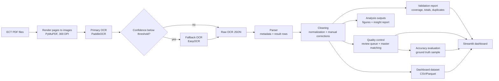

# Architecture

## Data Contract

The main long-format dataset is `data/processed/election_results_long.csv`.

Required columns:

- `province`, `constituency_no`, `form_type`, `vote_type`
- `polling_station_no`, `district`, `subdistrict`
- `choice_no`, `choice_name`, `party_name`, `votes`
- `eligible_voters`, `ballots_cast`, `valid_votes`, `invalid_votes`, `no_vote`
- `source_pdf`, `source_page`, `ocr_engine`, `ocr_confidence`, `validation_status`

## Required Forms

- `5_16`
- `5_16_partylist`
- `5_17`
- `5_17_partylist`
- `5_18`
- `5_18_partylist`

The election-day forms `5_18` and `5_18_partylist` must cover all 341 polling stations.
